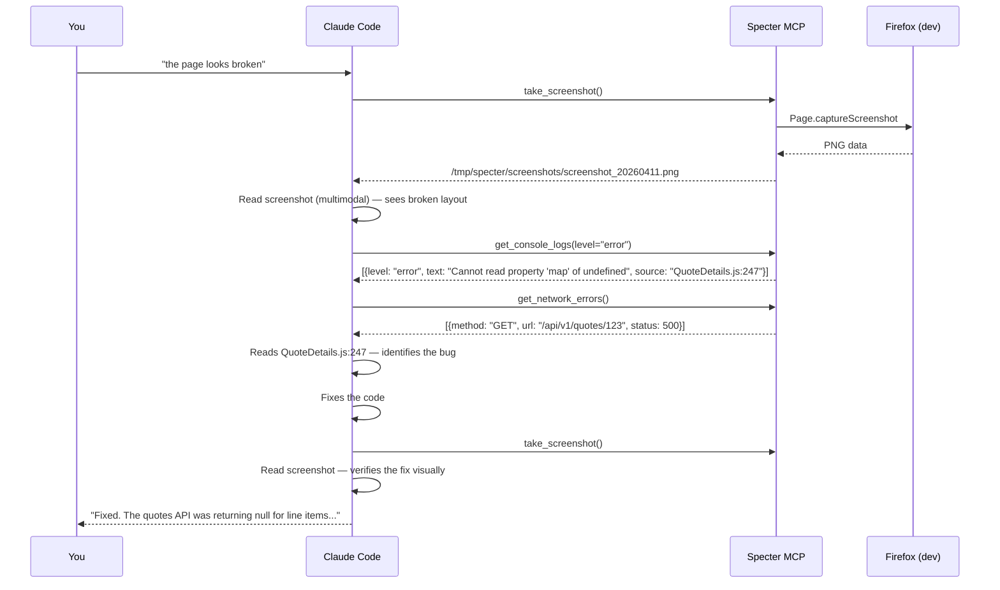
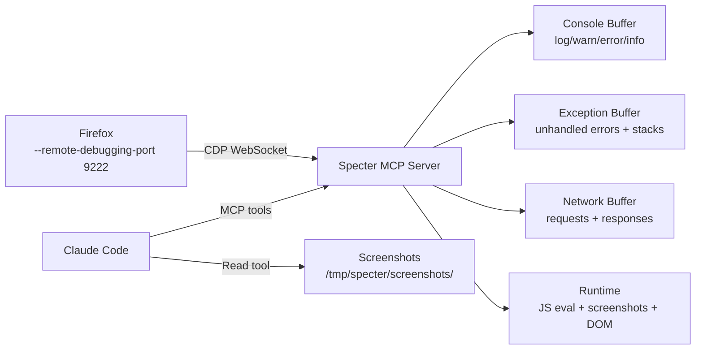
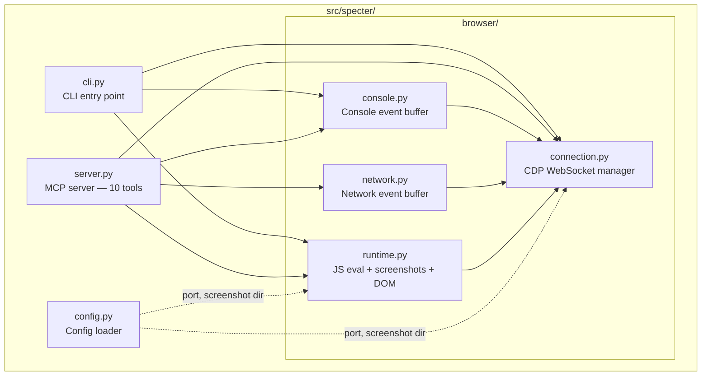

# Specter

> *The invisible observer.*

Specter is a **browser debugging MCP server** that connects to Firefox via the Chrome DevTools Protocol (CDP) and gives AI assistants direct eyes into the browser: console logs, JavaScript exceptions, network activity, screenshots, DOM inspection, and runtime JS evaluation — all as MCP tools that Claude can call autonomously during debugging.

Built for [Claude Code](https://docs.anthropic.com/en/docs/claude-code), but works with any MCP-compatible client.

Part of the dark MCP suite alongside [Séance](https://github.com/fsocietydisobey/seance) (semantic code search), [Scarlet](https://github.com/fsocietydisobey/scarlet) (codebase cartography), and Serena (LSP navigation).

## The debugging loop



## How it works



Specter connects to Firefox's CDP endpoint over WebSocket, enables the `Runtime`, `Network`, and `Page` domains, and streams events into ring buffers. Claude queries the buffers on demand via MCP tools.

## Prerequisites

Firefox must be launched with remote debugging enabled:

```bash
firefox --remote-debugging-port 9222
```

Or create an alias for development:

```bash
alias firefox-dev="firefox --remote-debugging-port 9222"
```

## Installation

```bash
git clone git@github.com:fsocietydisobey/specter.git
cd specter
uv sync
```

No API keys required. Fully local.

## CLI usage

```bash
# Check if Firefox is reachable
uv run specter status

# Print recent console logs
uv run specter logs
uv run specter logs --level error

# Take a screenshot
uv run specter screenshot
uv run specter screenshot --full           # full scrollable page
uv run specter screenshot -s ".main-content"  # specific element

# Start the MCP server
uv run specter serve
```

## MCP integration

### Claude Code

Register globally:

```bash
claude mcp add -s user specter -- uv --directory /path/to/specter run specter serve
```

Once registered, Claude gets these tools:

| Tool | What it does |
|---|---|
| `take_screenshot` | Capture page as PNG — Claude reads it with the Read tool (multimodal vision) |
| `get_console_logs` | Retrieve buffered console.log/warn/error/info output with source locations |
| `get_errors` | Retrieve unhandled JS exceptions with full stack traces |
| `get_network_errors` | Retrieve failed HTTP requests (4xx/5xx + network failures) |
| `get_network_log` | Retrieve all HTTP requests (for tracing API flow) |
| `evaluate_js` | Run JavaScript in the page and return the result |
| `get_page_info` | Current URL, title, document ready state |
| `get_dom_html` | Get rendered HTML of any CSS selector |
| `list_tabs` | List all open browser tabs with IDs, titles, URLs |
| `clear_logs` | Reset all event buffers (clean slate before reproducing a bug) |

### Other MCP clients

```json
{
  "mcpServers": {
    "specter": {
      "command": "uv",
      "args": ["--directory", "/path/to/specter", "run", "specter", "serve"]
    }
  }
}
```

## What Claude can do with these tools

### Visual debugging
```
Claude: take_screenshot() → reads the PNG → "I can see the sidebar is collapsed 
and the main content area shows a loading spinner that never resolves"
```

### Error diagnosis
```
Claude: get_errors() → "QuoteDetails.js:247 — Cannot read properties of null 
(reading 'map'). The quoteData.bids array is null when the API returns an 
empty quote. Fix: add a fallback: `(quoteData.bids ?? []).map(...)`"
```

### API flow tracing
```
Claude: get_network_log(url_filter="/api/v1") → sees the exact sequence of 
API calls, their status codes, and timing → "The /api/v1/quotes/123 call 
returns 200 but the response is missing the `bids` field entirely"
```

### Runtime state inspection
```
Claude: evaluate_js("JSON.stringify(window.__NEXT_DATA__.props)") → reads 
the server-side props → "The SSR is passing projectId but not quoteId"
```

### DOM verification
```
Claude: get_dom_html(".error-boundary") → sees the rendered error message → 
"The error boundary caught the crash but is showing a generic message. The 
actual error is in the console"
```

## Architecture



## Configuration

All via environment variables (no config file needed):

| Variable | Default | Description |
|---|---|---|
| `SPECTER_DEBUG_HOST` | `localhost` | CDP host |
| `SPECTER_DEBUG_PORT` | `9222` | CDP port (must match Firefox's `--remote-debugging-port`) |
| `SPECTER_SCREENSHOT_DIR` | `/tmp/specter/screenshots` | Where screenshots are saved |
| `SPECTER_MAX_BUFFER` | `1000` | Max buffered events per category |

## The full MCP suite

| Tool | What it does | Mode |
|---|---|---|
| **Serena** | LSP-powered symbol navigation | Read (compiler-precise) |
| **Séance** | Semantic code search via embeddings | Read (semantic-fuzzy) |
| **Scarlet** | Structural doc generation | Write (cartography) |
| **Specter** | Browser debugging via CDP | Read (runtime) |

Together: Serena finds symbols, Séance finds concepts, Scarlet writes the docs, Specter watches the browser. Claude orchestrates all four.

## Tech stack

- **[Chrome DevTools Protocol](https://chromedevtools.github.io/devtools-protocol/)** — browser communication (Firefox supports CDP experimentally)
- **[websockets](https://websockets.readthedocs.io/)** — CDP WebSocket connection
- **[httpx](https://www.python-httpx.org/)** — target discovery via `/json` endpoint
- **[MCP Python SDK](https://github.com/modelcontextprotocol/python-sdk)** — Model Context Protocol server
- **[Click](https://click.palletsprojects.com/)** — CLI framework
- **[uv](https://docs.astral.sh/uv/)** — Package management

## License

MIT
